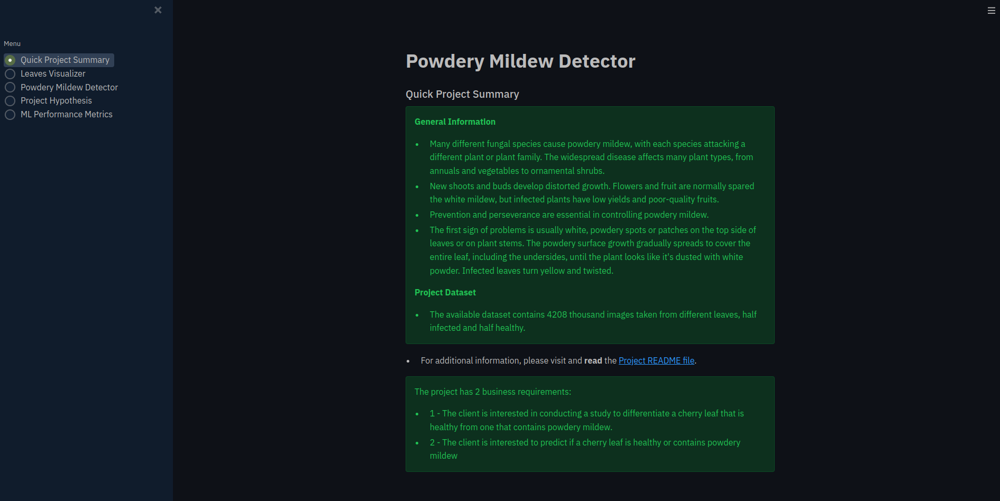
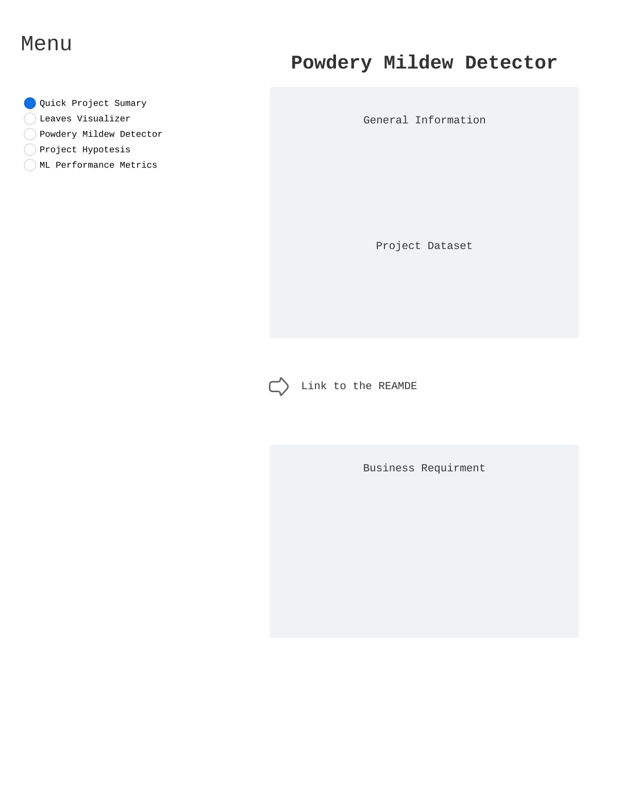
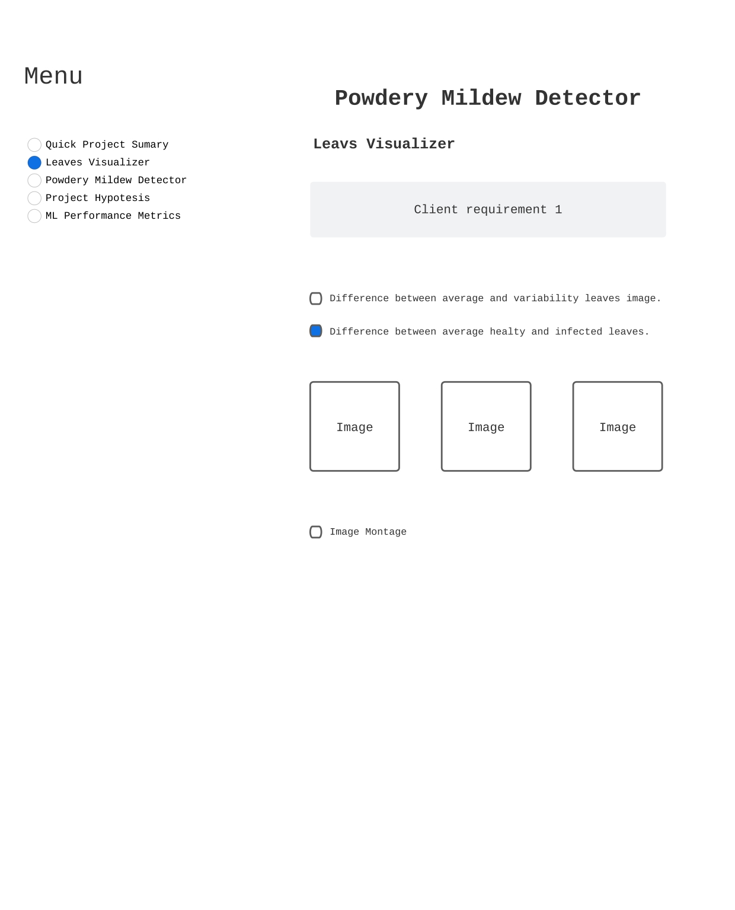
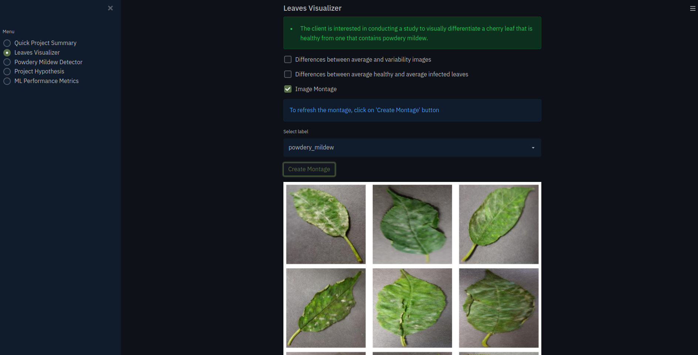
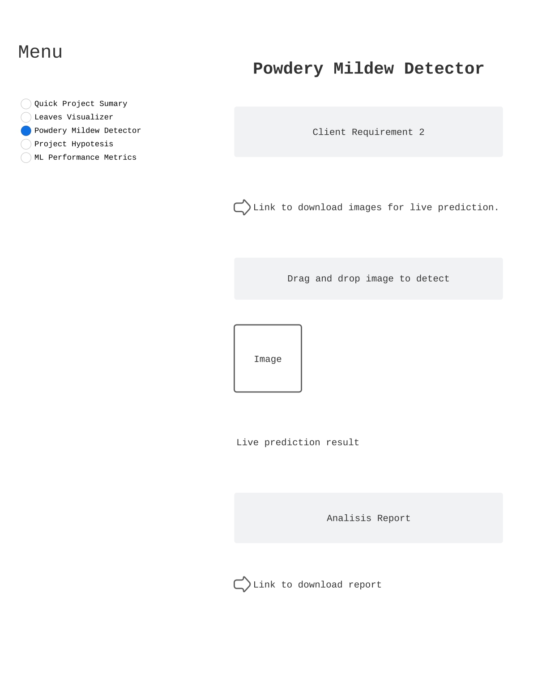
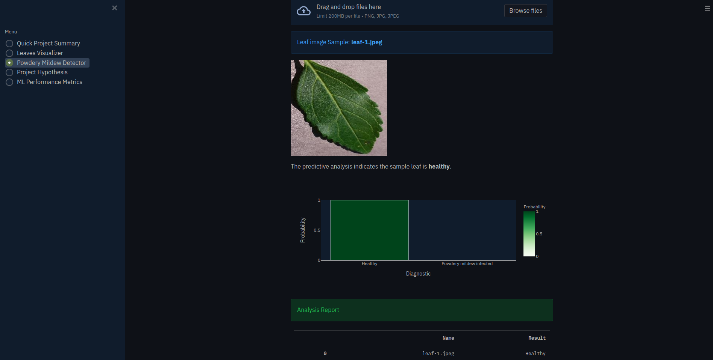
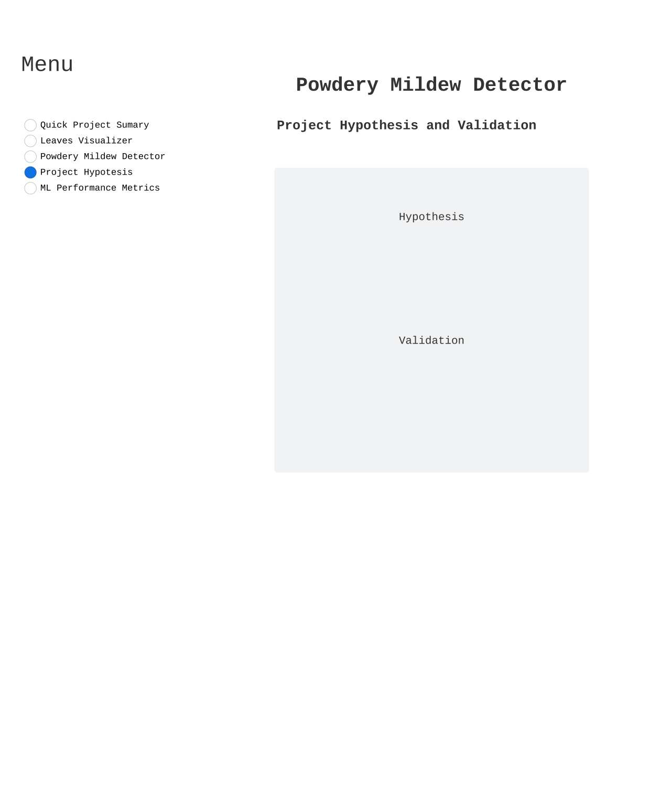
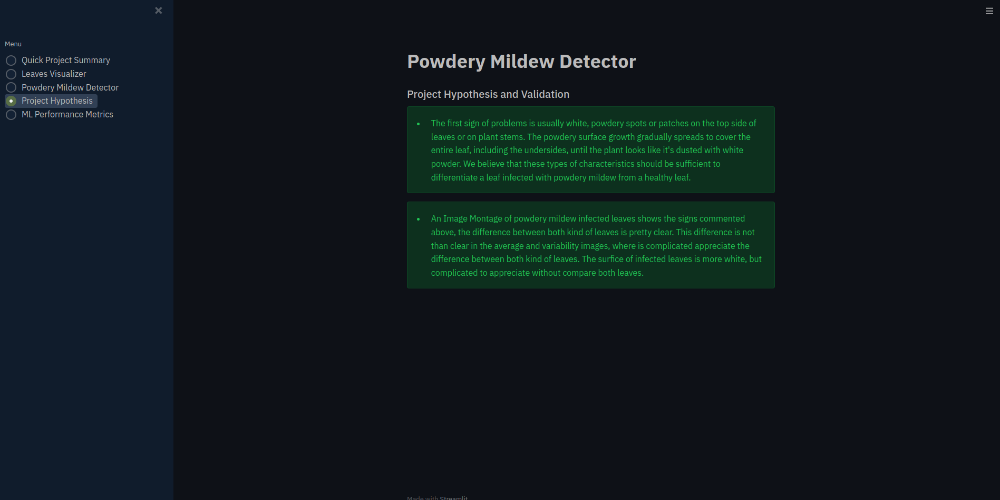
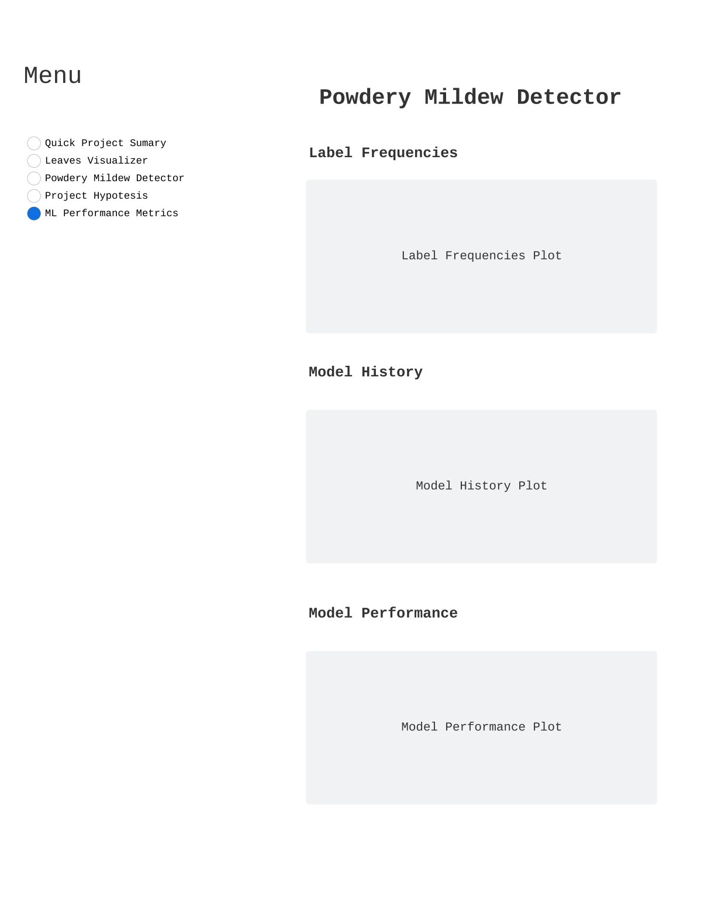
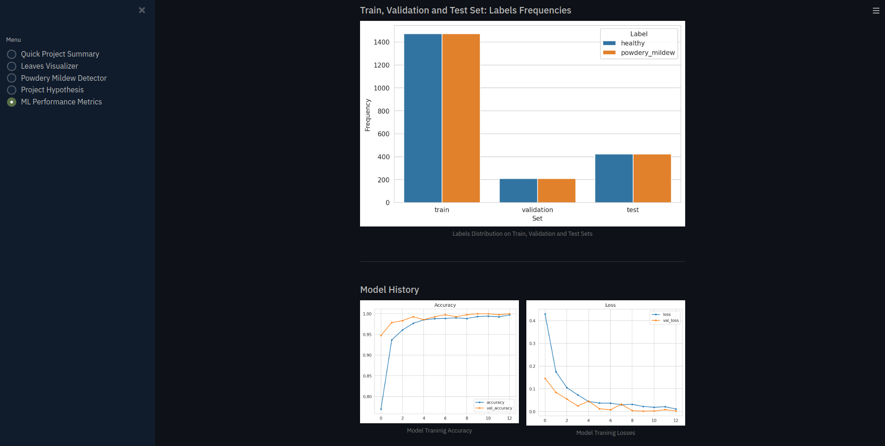

# Powdery Mildew in Cherry Leaves Detector

### [Fifth Code Institute Course Project](https://cherry-leaves-detector.herokuapp.com/)

## Dataset Content
* The dataset is sourced from [Kaggle](https://www.kaggle.com/codeinstitute/cherry-leaves). We created then a fictitious user story where predictive analytics can be applied in a real project in the workplace.
* The dataset contains +4 thousand images taken from client's crop fields. The images show cherry leaves that are healthy and cherry leaves that contain powdery mildew, which is a fungal disease that affects a wide range of plants. The cherry plantation crop is one of their finest products in the portfolio and the company is concerned about supplying the market with a product of compromised quality.

## Business Requirements
- The cherry plantation crop from Farmy & Foods is facing a challenge where their cherry plantations have been presenting powdery mildew. Currently, the process is to manually verify if a given cherry tree contains powdery mildew. An employee spends around 30 minutes in each tree, taking a few samples of tree leaves and verifying visually if the leaf tree is healthy or has powdery mildew. If it has powdery mildew, the employee applies a specific compound to kill the fungus. The time spent applying this compound is 1 minute.  The company has thousands of cherry trees located in multiple farms across the country. As a result, this manual process is not scalable due to time spent in the manual process inspection.

- To save time in this process, the IT team suggested an ML system that is capable of detecting instantly, using a leaf tree image, if it is healthy or has powdery mildew. A similar manual process is in place for other crops for detecting pests, and if this initiative is successful, there is a realistic chance to replicate this project to all other crops. The dataset is a collection of cherry leaf images provided by Farmy & Foods, taken from their crops.

    * 1 - The client is interested in conducting a study to visually differentiate a cherry leaf that is healthy and that contains powdery mildew.
    * 2 - The client is interested to predict if a cherry leaf is healthy or contains powdery mildew.

## Hypothesis and how to validate?
* According to specialist of [Garden Tech webpage](https://www.gardentech.com), powdery mildew is one of the easiest plant diseases to recognize. The first sign of problems is usually white, powdery spots or patches on the top side of leaves or on plant stems. The powdery surface growth gradually spreads to cover the entire leaf, including the undersides, until the plant looks like it's dusted with white powder. Infected leaves turn yellow and twisted.
    * An average image study can help to investigate it.

## Rationale to map the business requirements to the Data Visualizations and ML tasks
* **Business Requierement 1:** Data Visualization
    * We will display the average and variability image for each class(healthy or powdery mildew).
    * We will display the difference between an average healthy leaf and an average powdery mildew leaf.
    * We will display a image montage for each class of leaf, healty or powdery mildew.

* **Business Requirement 2:** Classification
    * We want to predict if a given leaf is healthy or contains powdery mildew.
    * We want to build a binary classifier and generate reports.

## ML Business Case
### PowderyMildewClf
* We want a ML model to predict if a leaf contains powdery mildew, based on historical image data. It is a supervised model, a 2-class, single-label, classification model.
* Our outcome is provide the Marianne McGuineys team a faster and reliable diagnostic if a given leaf has powdery spots or patches that can indicate that the cherry tree is not healthy.
* The model success metrics are
    * Accuracy of 97% or above on the test set
* The model output is defined as a flag, indicating if the leaf contains any feature that can show that the tree is infected. The staff of the plantation will take a picture of some leaves of the tree and upload them to the App. The preciction is made on the fly.
* Heuristic: Currently, the process is to manually verify if a given cherry tree contains powdery mildew. An employee spends around 30 minutes in each tree, taking a few samples of tree leaves and verifying visually if the leaf tree is healthy or has powdery mildew. If it has powdery mildew, the employee applies a specific compound to kill the fungus. The time spent applying this compound is 1 minute. The company has thousands of cherry trees located in multiple farms across the country. As a result, this manual process is not scalable due to time spent in the manual process inspection.
* The training data to fit the model come from [Kaggle](https://www.kaggle.com/), there is no description available about the dataset, it contains 2104 files of healthy leaves and 2104 files of powdery mildew leaves.
    * Train data - target: leaf infected or not; features: all images

## Project Dashboard

* Different user stories, task and bugs were documented in the [Project Dashboard](https://github.com/users/alerebal/projects/2)

## Dashboard Design

### Page 1: Quick Project Summary
* Quick project summary
    * General information
        * Many different fungal species cause powdery mildew, with each species attacking a different plant or plant family. The widespread disease affects many plant types, from annuals and vegetables to ornamental shrubs.
        * New shoots and buds develop distorted growth. Flowers and fruit are normally spared the white mildew, but infected plants have low yields and poor-quality fruits.
        * Prevention and perseverance are essential in controlling powdery mildew. 
        * The first sign of problems is usually white, powdery spots or patches on the top side of leaves or on plant stems. The powdery surface growth gradually spreads to cover the entire leaf, including the undersides, until the plant looks like it's dusted with white powder. Infected leaves turn yellow and twisted.
    * Project Dataset
        * The available dataset contains 4208 thousand images taken from different leaves, half infected and half healthy.
    * Link to addition information
    * Business Requirements
        * The client is interested in conducting a study to visually differentiate a cherry leaf that is healthy and that contains powdery mildew.
        * The client is interested to predict if a cherry leaf is healthy or contains powdery mildew.

**Wireframe**

**Final page(custom theme)**

### Page 2: Leaves Visualizer
* It will answer business requirement 1
    * Checkbox 1 - Difference between average and variability image
    * Checkbox 2 - Difference between average healthy and average not healthy leaves
    * Checkbox 3 - Image Montage

**Wireframe**

**Final page(custom theme)**

### Page 3: Powdery Wildew Detector
* Business requirement 2 information.
* Link to download a set of healthy and not healthy leaves images for live prediction.
* User Interface with a file uploader widget. The user should upload leaves images. It will display the image and a prediction statement, indicating if the leaf is healthy or not.
* Table with image name and prediction results.
* Download button to download table.

**Wireframe**

**Final page(custom theme)**

### Page 4: Project Hypothesis and Validation
* We have done our research and know that the first sign of problems is usually white, powdery spots or patches on the top side of leaves or on plant stems. If we see that kind of signs in a leaf, the tree has powdery mildew infection.

**Wireframe**

**Final page(custom theme)**

### Page 5: ML Performance Metrics
* Label Frequencies for Train, Validation and Test Sets
* Model History - Accuracy and Losses
* Model Evaluation result

**Wireframe**

**Final page(custom theme)**

## Bugs
### First deployment fail - (Fixed)
* [The stack of Heroku did not support Python 3.8.12](https://github.com/alerebal/My-first-agile-project/issues/28)

### Streamlit theme does not work in Heroku - (Fixed)
* [The theme I have created does not work on Heroku](https://github.com/alerebal/My-first-agile-project/issues/29)

## Deployment
### Heroku

* The App live link is: https://cherry-leaves-detector.herokuapp.com/
* The project was deployed to Heroku using the following steps.

1. I created an App in my Heroku account.
2. I cloned my GitHub code in my local machine(previously I had been working in Gitpod) because it is no longer available the possibility to link the GitHub project to Heroku, then I logged in to Heroku typing:
        
        heroku login -i

3. The next step was push my code to Heroku with the command:

        git push heroku main

    * I had a problem here because when you create an app on Heroku, the stack by default does not support the Python version I was using, so I had to change the stack of my project from 22 to 20, the generated bug is [here](https://github.com/alerebal/My-first-agile-project/issues/28)

* After the bug was fixed, the app was running without problem.
* I did not do any other usual step to deploy on Heroku like create a Procfile or Requirements files because the template I have used already had them.

## Libraries used in the project

### Streamlit

- [Streamlit](https://streamlit.io/) is an open-source Python library that makes it easy to create and share beautiful, custom web apps for machine learning and data science. In just a few minutes you can build and deploy powerful data apps.

- I used this library to create and deploy the application, another libraries or frameworks can be use to deploy the application(the dashboard or API), as Django, Flask, etc, but I have use [Streamlit](https://streamlit.io/) for all the steps.

### Numpy

- [NumPy](https://numpy.org/) is an open source project aiming to enable numerical computing with Python. It was created in 2005, building on the early work of the Numeric and Numarray libraries. 

- [NumPy](https://numpy.org/) help us to work with arrays. In this case it was useful because the images are arrays of data and the rest of libraries use [NumPy](https://numpy.org/) under the hood.

- I have used it to convert the images into an array, to generate empty arrays than were used to store images data, and working with data inside arrays in general.

### Pandas

- [Pandas](https://pandas.pydata.org/) is a fast, powerful, flexible and easy to use open source data analysis and manipulation tool, built on top of the Python programming language.

- [Pandas](https://pandas.pydata.org/) is used to manipulate and analyze the data, it's one of the more important libraries in data science and help us to clean data sets.

- I have used [Pandas](https://pandas.pydata.org/) to create some dataframes than after been created were plotted with another tool.

### Matplotlib

- [Matplotlib](https://matplotlib.org/) is a comprehensive library for creating static, animated, and interactive visualizations in Python.

- I used it to create the figure and axes of the plots, set them, show the plot and save it as an png image. I used it to plot augmented images and load images as well.

### Seaborn

- [Seaborn](https://seaborn.pydata.org/) is a Python data visualization library based on matplotlib. It provides a high-level interface for drawing attractive and informative statistical graphics.

- I used it to give values to the axes, set background and bars in the plots than after were shown with [Matplotlib](https://matplotlib.org/).

### Plotly

- [Plotly](https://plotly.com) provides online graphing, analytics, and statistics tools for individuals and collaboration, as well as scientific graphing libraries for Python, R, MATLAB, Perl, Julia, Arduino, and REST.

- I used it to set the plot of the predictions probabilyity results, and then show the plot with [streamlit plotly_chart](https://docs.streamlit.io/library/api-reference/charts/st.plotly_chart).

### Tensorflow

- [TensorFlow](https://www.tensorflow.org/) is an open-source library developed by Google primarily for deep learning applications.
[TensorFlow](https://www.tensorflow.org/) accepts data in the form of multi-dimensional arrays of higher dimensions called tensors. Multi-dimensional arrays are very handy in handling large amounts of data.

- I used it to processing images, generate data to fit model, and ML tasks in general as create a model, fit the model, evaluate it, etc.

### Keras

- [Keras](https://keras.io/) is a high-level, deep learning API developed by Google for implementing neural networks. It is written in Python and is used to make the implementation of neural networks easy. It also supports multiple backend neural network computation.           

- I have used it as a layer over [TensorFlow](https://www.tensorflow.org/). All the tasks than required [TensorFlow](https://www.tensorflow.org/) were done using [keras](https://keras.io/).

### PIL

- [Python Imaging Library](https://en.wikipedia.org/wiki/Python_Imaging_Library) is a free and open-source additional library for the Python programming language that adds support for opening, manipulating, and saving many different image file formats.

- It has been used to open images.

## Credits 

* The code and the design of the dashboard was taken from the [walkthrough project Malalaria Detector](https://github.com/Code-Institute-Org/WalkthroughProject01) of the [Code Institute](https://codeinstitute.net/ie/) course, I only made few minor modifications on both of them, essentially is the same project, but doing this way helped me to understand the concept of ML and Data Sciens in a deeper way.

- All what I have learned about of the powdery mildew and I have used to do this project was taken from [Garden Tech webpage](https://www.gardentech.com).

- I have used the [Streamlit](https://docs.streamlit.io/library/advanced-features/theming) website to work on the project dashboard custom theme.

